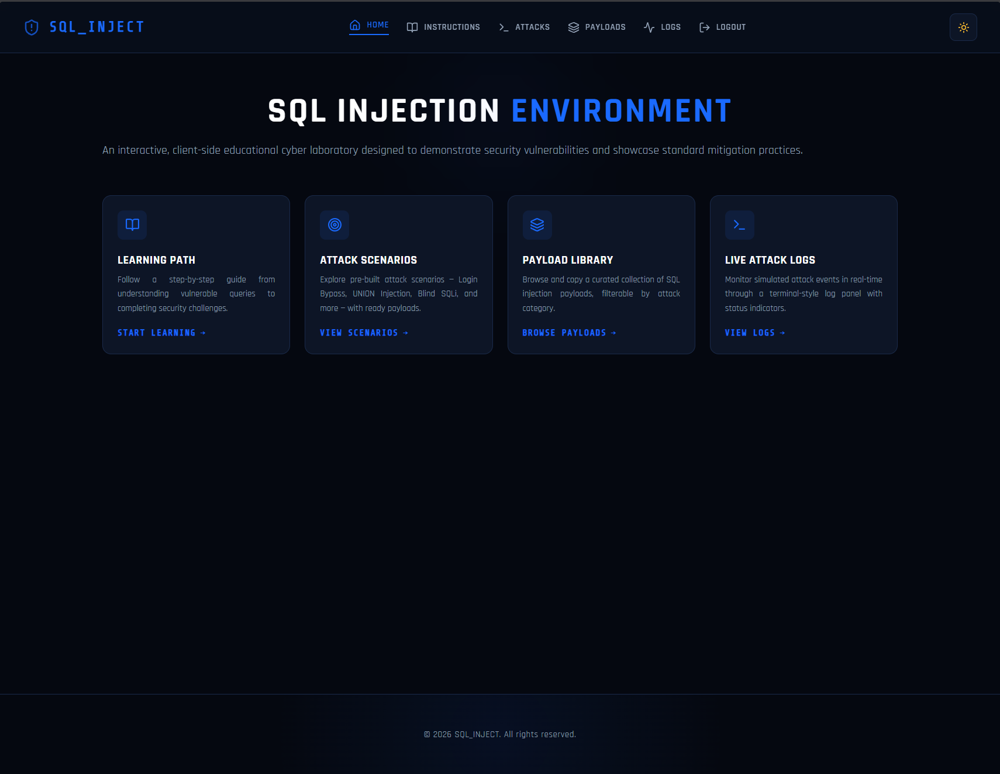
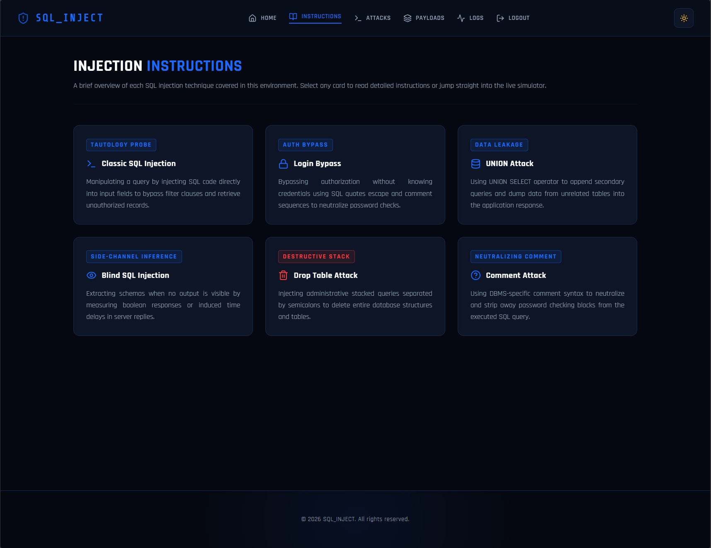
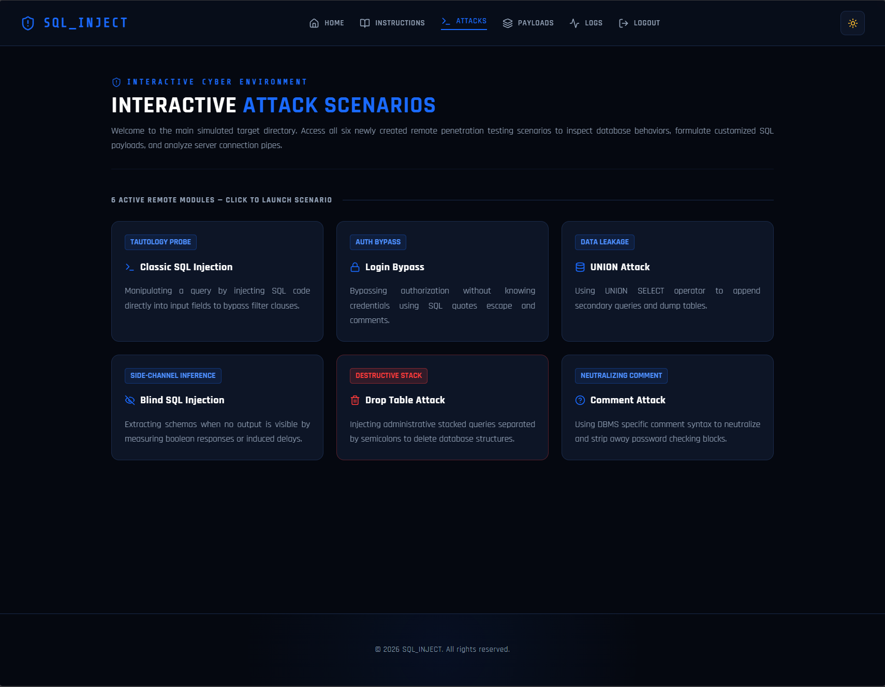
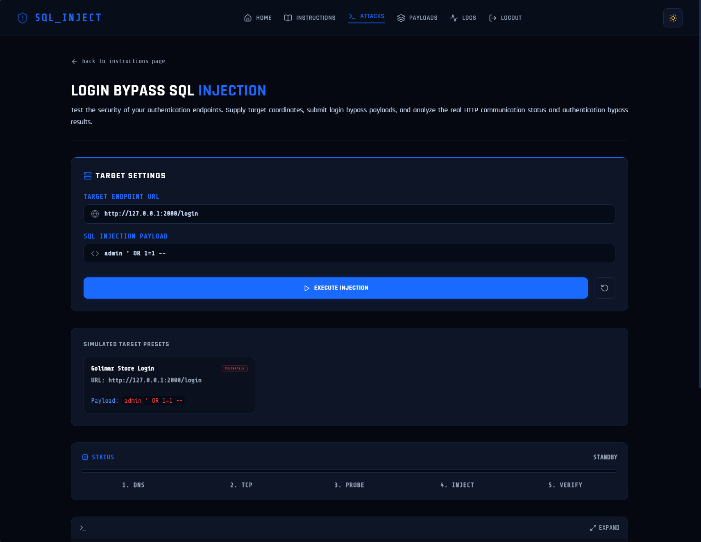
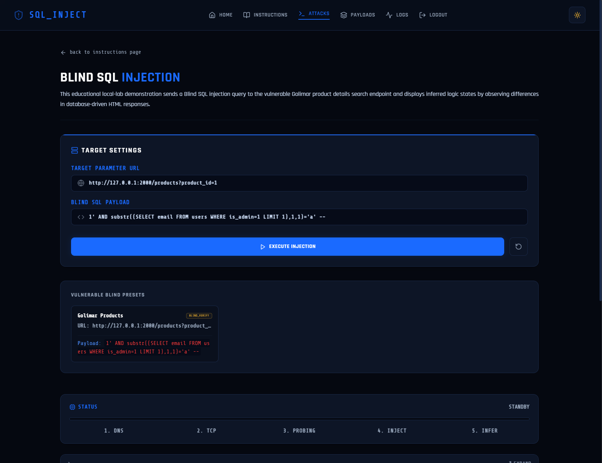
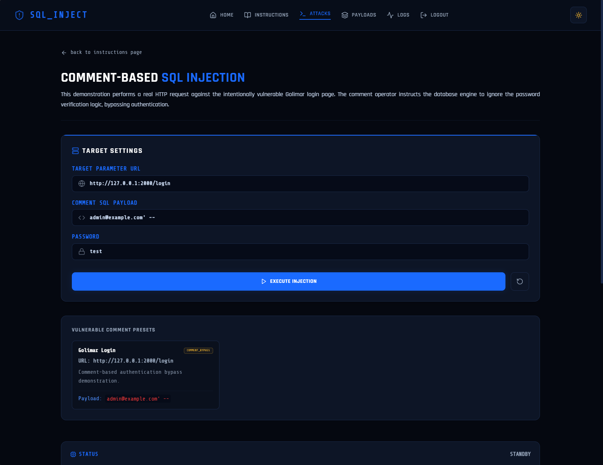
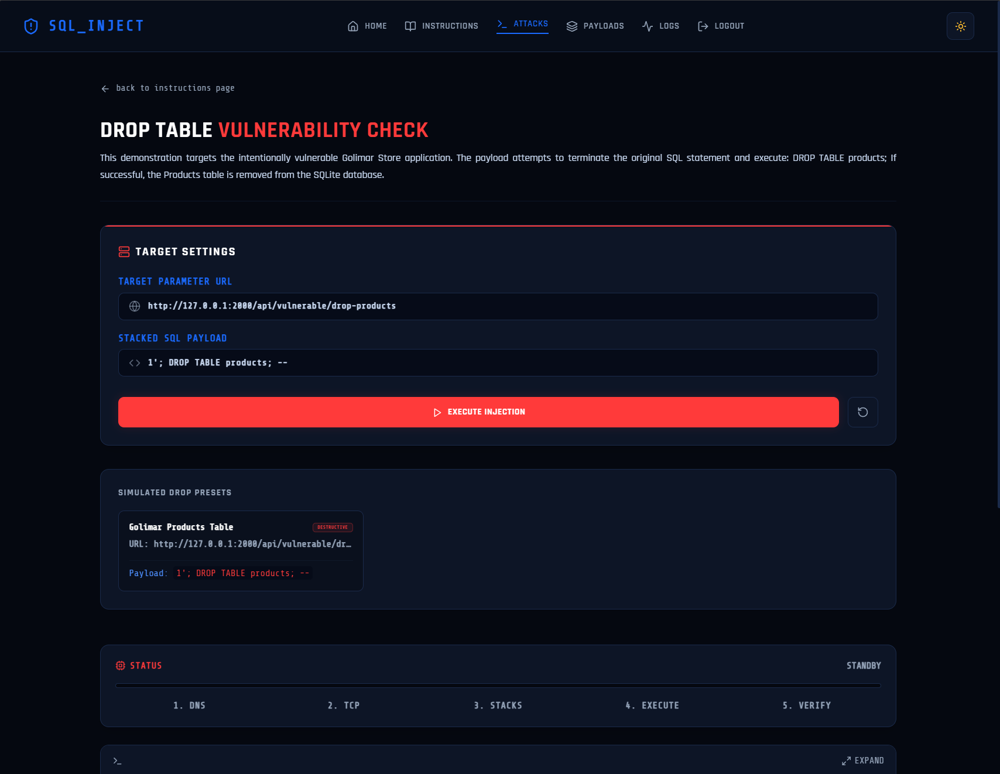
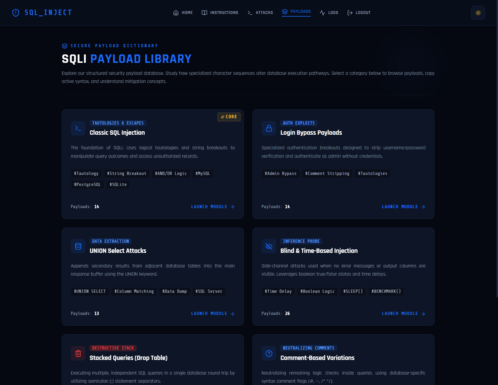
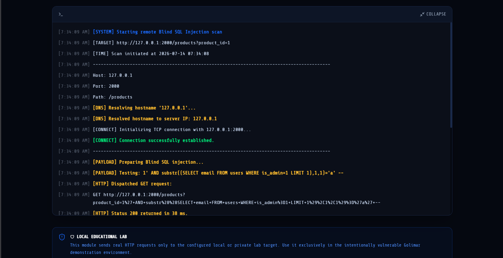

# 🛡️ sql-inject

<p align="center">
  
</p>

<p align="center">
  <strong>Interactive SQL Injection Learning Environment</strong>
</p>

<p align="center">
  A full-stack educational cybersecurity laboratory for learning SQL Injection attacks, vulnerable query behavior, attack analysis, and secure coding practices through hands-on demonstrations.
</p>

<p align="center">
  <a href="https://github.com/clecap/cs-2026-group-c">
    
  </a>
  
  
  
  
  
  
  
  
</p>

---

## 📖 Overview

**sql-inject** is an educational cybersecurity platform developed to demonstrate SQL Injection vulnerabilities in a safe and controlled laboratory environment.

The application combines theoretical instruction with practical attack simulations. Students can inspect vulnerable behavior, enter SQL Injection payloads, run demonstrations against intentionally vulnerable local endpoints, and observe detailed terminal-style results.

The project focuses on both offensive and defensive concepts:

* How SQL Injection vulnerabilities are created
* How malicious input changes SQL query behavior
* How authentication can be bypassed
* How data can be extracted with UNION queries
* How Blind SQL Injection works
* How SQL comments can alter queries
* How destructive SQL payloads can be detected safely
* How parameterized queries prevent SQL Injection

This project was developed as part of a Cybersecurity course at the **University of Rostock**.

> [!IMPORTANT]
> This application is intentionally designed for cybersecurity education. Only use it against local systems or systems for which you have explicit authorization.

---

## ✨ Main Features

### 📚 Interactive Learning Modules

The project contains instructional pages for the main SQL Injection techniques:

* Classic SQL Injection
* Login Bypass
* UNION-Based SQL Injection
* Blind SQL Injection
* Comment-Based SQL Injection
* DROP TABLE Attacks
* Secure Coding Practices
* Parameterized Queries

Each instructional module explains:

* What the attack is
* Why the vulnerability exists
* How the payload affects the query
* What result the attacker expects
* How developers can prevent the attack

---

### ⚔️ Attack Demonstrations

The application includes several interactive attack pages.

#### Classic SQL Injection

Demonstrates how untrusted user input can modify the structure and logic of an SQL statement.

#### Login Bypass

Demonstrates how vulnerable authentication queries can be manipulated to return a valid user without knowing the correct password.

Example educational payload:

```sql
admin ' OR 1=1 --
```

#### UNION-Based SQL Injection

Demonstrates how an attacker can combine the output of an original query with data returned by an injected `UNION SELECT` statement.

#### Database Table Enumeration

Demonstrates how database metadata, such as table names, may be extracted from `information_schema` when an application is vulnerable to UNION-based SQL Injection.

#### Blind SQL Injection

Demonstrates how true and false conditions can be used to infer information when database errors or direct query results are not displayed.

#### Comment-Based SQL Injection

Demonstrates how SQL comment operators can remove or disable the remaining part of a vulnerable query.

#### DROP TABLE Detection

Demonstrates whether an endpoint appears vulnerable to destructive stacked-query payloads.

Example payload:

```sql
1'; DROP TABLE products; --
```

The DROP TABLE demonstration uses a non-destructive safety mode. The payload may be displayed and analyzed, but the application should not intentionally delete the target table during the educational check.

---

### 🖥️ Live Attack Terminal

Attack results are shown through a terminal-style interface.

Depending on the selected attack, the terminal can display:

```text
[SYSTEM] Attack simulation started
[TARGET] Target URL
[TIME] Scan start time
[DNS] Hostname resolution
[CONNECT] TCP connection status
[PAYLOAD] Selected SQL Injection payload
[HTTP] HTTP request details
[RESPONSE] Target response
[ANALYSIS] Vulnerability analysis
[RESULT] Final result
[SAFETY] Non-destructive execution information
```

The terminal helps students understand the sequence of an attack rather than seeing only a final success or failure message.

---

### 📦 Payload Library

The payload library contains organized SQL Injection examples for educational use.

Payload categories include:

* Authentication bypass payloads
* Boolean condition payloads
* UNION SELECT payloads
* Blind SQL Injection payloads
* Comment injection payloads
* Database enumeration payloads
* DROP TABLE examples
* General testing payloads

---

### 🔒 Secure and Vulnerable Query Examples

The project demonstrates the difference between insecure string concatenation and parameterized SQL queries.

#### Vulnerable Query

```python
query = (
    "SELECT * FROM users "
    f"WHERE username = '{username}' "
    f"AND password = '{password}'"
)
```

A malicious value can become part of the SQL syntax because the input is inserted directly into the query.

Equivalent SQL:

```sql
SELECT *
FROM users
WHERE username = '$username'
AND password = '$password';
```

#### Secure Query

```python
cursor.execute(
    """
    SELECT *
    FROM users
    WHERE username = ?
    AND password = ?
    """,
    (username, password),
)
```

Equivalent parameterized SQL:

```sql
SELECT *
FROM users
WHERE username = ?
AND password = ?;
```

With parameterized queries, user input is treated as data instead of executable SQL syntax.

---

## 🏗️ Architecture

```text
┌──────────────────────────────┐
│       React Frontend         │
│                              │
│  Instructions                │
│  Attack Pages                │
│  Payload Library             │
│  Live Attack Terminal        │
└──────────────┬───────────────┘
               │
               │ REST API
               ▼
┌──────────────────────────────┐
│        Flask Backend         │
│                              │
│  API Routes                  │
│  Attack Controllers          │
│  Input Validation            │
│  Response Analysis           │
└──────────────┬───────────────┘
               │
       ┌───────┴────────┐
       │                │
       ▼                ▼
┌──────────────┐  ┌──────────────────────┐
│ Local SQLite │  │ External Local Lab   │
│ Database     │  │ Golimar Store        │
└──────────────┘  │ Vulnerable API       │
                  └──────────────────────┘
```

Some demonstrations can run against the project's internal backend, while remote attack demonstrations can target an intentionally vulnerable local application such as Golimar Store.

---

## 🛠️ Technology Stack

| Technology     | Purpose                                  |
| -------------- | ---------------------------------------- |
| React          | Frontend user interface                  |
| Vite           | Frontend development and build tool      |
| JavaScript     | Frontend application logic               |
| Tailwind CSS   | Styling and responsive layout            |
| Flask          | Backend REST API                         |
| Python         | Attack simulation and response analysis  |
| SQLite         | Local educational database               |
| Docker         | Containerized development and deployment |
| Docker Compose | Multi-service orchestration              |
| HashRouter     | Client-side frontend routing             |

---

## 📂 Project Structure

```text
sql-inject/
│
├── frontend/
│   ├── public/
│   ├── src/
│   │   ├── assets/
│   │   ├── components/
│   │   ├── pages/
│   │   ├── services/
│   │   ├── App.jsx
│   │   └── main.jsx
│   ├── package.json
│   └── vite.config.js
│
├── backend/
│   ├── attacks/
│   ├── database/
│   ├── routes/
│   ├── static/
│   ├── requirements.txt
│   └── run.py
│
├── screenshots/
│   ├── demo.gif
│   ├── home.png
│   ├── instructions.png
│   ├── attacks.png
│   ├── login-bypass.png
│   ├── union-attack.png
│   ├── blind-injection.png
│   ├── comment-attack.png
│   ├── drop-table.png
│   ├── payload-library.png
│   └── terminal.png
│
├── .gitignore
├── docker-compose.yml
├── Dockerfile
└── README.md
```

---

## 🔗 Application Routes

The frontend uses hash-based routing.

Example routes:

```text
http://localhost:3000/#/
http://localhost:3000/#/instructions
http://localhost:3000/#/attacks
http://localhost:3000/#/attacks/login-bypass
http://localhost:3000/#/attacks/union-attack
http://localhost:3000/#/attacks/blind-injection
http://localhost:3000/#/attacks/comment-attack
http://localhost:3000/#/attacks/drop-table
```

Hash-based routing allows the application to preserve frontend navigation without requiring special web server route configuration.

---

## 🚀 Getting Started

### Prerequisites

Before running the project, install:

* Git
* Docker Desktop and Docker Compose

For manual installation:

* Python 3
* Node.js
* npm

---

## 📥 Clone the Repository

The repository uses the `master` branch.

```bash
git clone --branch master https://github.com/clecap/cs-2026-group-c.git sql-inject
```

Enter the project directory:

```bash
cd sql-inject
```

You can also clone the repository first and then switch branches:

```bash
git clone https://github.com/clecap/cs-2026-group-c.git sql-inject
cd sql-inject
git checkout master
```

---

## 🐳 Run with Docker

Build and start the project:

```bash
docker compose up --build
```

To run the containers in the background:

```bash
docker compose up --build -d
```

To stop the project:

```bash
docker compose down
```

After startup, open the frontend:

```text
http://localhost:3000
```

The backend is typically available at:

```text
http://localhost:5000
```

The exact ports should match the values defined in `docker-compose.yml`.

---

## 💻 Manual Installation

### Start the Backend

Open a terminal:

```bash
cd backend
```

Create a Python virtual environment:

#### Windows PowerShell

```powershell
python -m venv .venv
.venv\Scripts\Activate.ps1
```

#### Linux or macOS

```bash
python3 -m venv .venv
source .venv/bin/activate
```

Install backend dependencies:

```bash
pip install -r requirements.txt
```

Start the Flask backend:

```bash
python run.py
```

---

### Start the Frontend

Open a second terminal:

```bash
cd frontend
```

Install frontend dependencies:

```bash
npm install
```

Start the Vite development server:

```bash
npm run dev
```

Open the address shown by Vite, usually:

```text
http://localhost:3000
```

or:

```text
http://localhost:5173
```

The exact port depends on the Vite configuration.

---

## 🧪 Vulnerable Target Application

Some remote demonstrations are designed to communicate with an intentionally vulnerable local target such as Golimar Store.

Example local target endpoints may include:

```text
http://127.0.0.1:2000/login
http://127.0.0.1:2000/api/vulnerable/search
http://127.0.0.1:2000/api/vulnerable/drop-products
```

The vulnerable target must be running before starting a remote attack demonstration.

> [!NOTE]
> `127.0.0.1` from inside a Docker container refers to that container itself. If the SQL Injection backend runs inside Docker while Golimar Store runs directly on the host, you may need to use:
>
> ```text
> http://host.docker.internal:2000
> ```
>
> The correct address depends on the Docker and network configuration.

---

## 🗄️ Database Setup

When the project includes a database seed script, run it from the backend directory or from the correct Docker container.

Example local command:

```bash
python backend/database/seed.py
```

Example Docker command:

```bash
docker exec -it <container-name> sh
```

Then inside the container:

```bash
cd /app
python database/seed.py
```

The exact command depends on the application's container name, working directory, and Python import structure.

---

## 📡 Backend API

The Flask backend receives attack requests from the frontend and returns structured responses.

A typical request contains:

```json
{
  "url": "http://127.0.0.1:2000/api/vulnerable/search",
  "payload": "' UNION SELECT ..."
}
```

A typical response may contain:

```json
{
  "success": true,
  "vulnerable": true,
  "status_code": 200,
  "logs": [],
  "analysis": "The endpoint appears vulnerable."
}
```

The exact API route and response fields depend on the selected attack module.

---

## 🛡️ Security Mitigations

SQL Injection can be prevented by combining several defensive practices.

### Use Parameterized Queries

Never concatenate user input directly into an SQL statement.

```python
cursor.execute(
    "SELECT * FROM users WHERE username = ?",
    (username,),
)
```

### Validate Input

Check the expected type, length, and format of user-controlled values.

### Apply Least Privilege

The database account used by the application should only have the permissions it needs.

A web application account usually should not be able to:

```sql
DROP TABLE
CREATE USER
GRANT
ALTER DATABASE
```

### Avoid Detailed Database Errors

Do not expose raw SQL errors, database engine details, table names, or query structures to users.

### Store Passwords Securely

Passwords should be stored using a modern password hashing algorithm rather than plain text.

Recommended examples include:

* Argon2
* bcrypt
* scrypt

### Monitor Suspicious Requests

Applications should log unusual input patterns and repeated failed requests.

---

## 🎯 Educational Objectives

After using this project, students should be able to:

* Explain how SQL Injection vulnerabilities occur
* Identify insecure SQL string construction
* Understand authentication bypass attacks
* Explain how UNION-based extraction works
* Understand Boolean-based Blind SQL Injection
* Recognize SQL comment abuse
* Explain database metadata enumeration
* Understand the risks of stacked SQL queries
* Compare vulnerable and secure query implementations
* Use parameterized queries correctly
* Apply least-privilege database permissions
* Interpret HTTP and terminal-style attack results

---

## 📸 Screenshots

### 🏠 Home Page

<p align="center">
  
</p>

---

### 📚 Instruction Pages

<p align="center">
  
</p>

---

### ⚔️ Attack Dashboard

<p align="center">
  
</p>

---

### 🔑 Login Bypass

<p align="center">
  
</p>

---

### 🔍 UNION-Based SQL Injection

<p align="center">
  
</p>

---

### 👁️ Blind SQL Injection

<p align="center">
  
</p>

---

### 💬 Comment-Based SQL Injection

<p align="center">
  
</p>

---

### 💣 DROP TABLE Detection

<p align="center">
  
</p>

---

### 📦 Payload Library

<p align="center">
  
</p>

---

### 🖥️ Live Attack Terminal

<p align="center">
  
</p>

---

## 🎥 Creating the Demo GIF

Record a short demonstration containing:

1. Opening the home page
2. Navigating to the attack dashboard
3. Opening one attack page
4. Selecting or entering a payload
5. Running the demonstration
6. Expanding the terminal
7. Showing the final vulnerability result

Save the file as:

```text
screenshots/demo.gif
```

Recommended settings:

* Duration: 10–20 seconds
* Width: approximately 1200–1600 pixels
* Frame rate: 10–15 FPS
* File size: preferably below 10 MB
* Avoid recording passwords, tokens, personal files, or private browser tabs

---

## 🖼️ Screenshot File Names

Use the following file structure so all README image links work correctly:

```text
screenshots/
├── demo.gif
├── home.png
├── instructions.png
├── attacks.png
├── login-bypass.png
├── union-attack.png
├── blind-injection.png
├── comment-attack.png
├── drop-table.png
├── payload-library.png
└── terminal.png
```

File names are case-sensitive on GitHub. For example:

```text
screenshots/Home.png
```

is different from:

```text
screenshots/home.png
```

---

## ⚠️ Disclaimer

This project contains intentionally vulnerable functionality and SQL Injection payload examples.

It is intended strictly for:

* Cybersecurity education
* Academic demonstrations
* Authorized security training
* Controlled laboratory environments
* Security research on owned systems

Do not use the attacks, payloads, or techniques in this repository against systems that you do not own or have explicit permission to test.

The authors and contributors are not responsible for unauthorized or illegal use of this project.

---

## 🎓 Academic Project

Developed as part of the **Cybersecurity course** at the **University of Rostock**.

Repository:

```text
https://github.com/clecap/cs-2026-group-c
```

Primary branch:

```text
master
```

---

## 🤝 Contributing

Contributions should be made through a separate branch.

Create a new branch:

```bash
git checkout master
git pull origin master
git checkout -b feature/your-feature-name
```

Commit your changes:

```bash
git add .
git commit -m "Describe the change"
```

Push the branch:

```bash
git push origin feature/your-feature-name
```

Then open a pull request into the `master` branch.

---

## 📄 License

This project was developed for academic and educational purposes.

Before reusing or redistributing the source code, review the repository's license file and the University course requirements.

---

<p align="center">
  <strong>Learn how SQL Injection works so you can build applications that prevent it.</strong>
</p>

<p align="center">
  <a href="https://github.com/clecap/cs-2026-group-c">
    View the sql-inject repository on GitHub
  </a>
</p>
#
